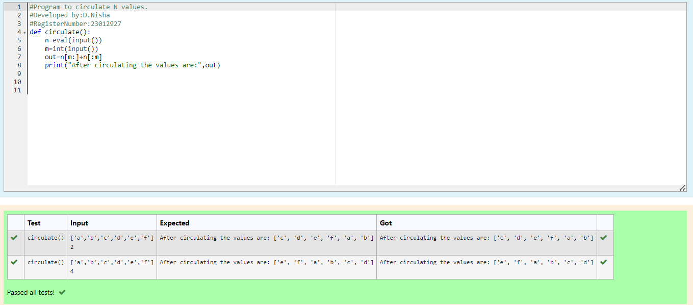

# Circulate-the-values-of-N-variables
## Aim:
To write a python program to circulate the n variables using function concept
## Equipment’s required:
PC
Anaconda - Python 3.7
## Algorithm: 
### Step 1:
Program the code with def circulate.
### Step 2: 
Get the two value from the user for the number of rotation.
### Step 3: 
Print the circulating values.
### Step 4: 
Using the slicing concept rotate the list.
### Step 5: 
Give print statement.
### Step 6: 
Execute the program.
## Program:
```
#Program to circulate N values.
#Developed by:D.Nisha
#RegisterNumber:23012927
def circulate():
    n=eval(input())
    m=int(input())
    out=n[m:]+n[:m]
    print("After circulating the values are:",out)
```  


## Output:


## Result:
This program is successfully executed to circulte n variables.